# Autonomous AI Agent on AWS Lightsail

This repository documents an autonomous AI agent running 24/7 on an AWS Lightsail Linux instance. The setup pairs [Hermes Agent](https://github.com/NousResearch/Hermes-Agent) as the background task runner with [OmniRoute](https://github.com/diegosouzapw/omniroute) as a local AI gateway to pool free-tier LLMs. Everything is operated remotely via Telegram and managed securely through a private [Tailscale](https://tailscale.com/) mesh network without opening web ports to the public internet.

---

## Architecture

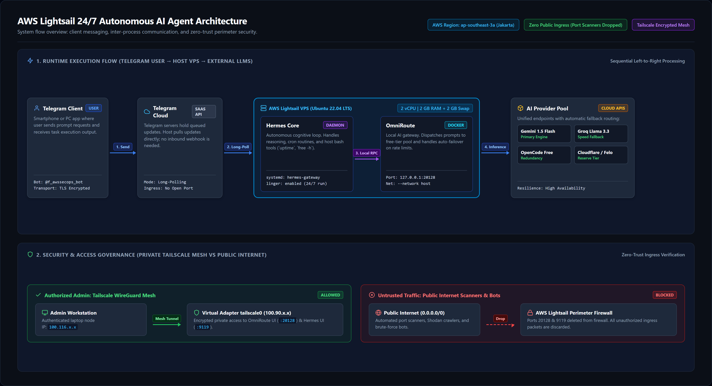

The system works through two separate flows:

1. **Telegram Bot Flow (Daily Usage)**
   - You send a message or task to the bot on Telegram.
   - The Telegram cloud holds the message in its queue.
   - Hermes Agent on the VPS pulls the message using outbound HTTPS polling (port 443). The VPS never opens an inbound port for webhooks.
   - Hermes forwards the prompt locally to OmniRoute at `http://127.0.0.1:20128/v1`.
   - OmniRoute routes the request to an external LLM (Gemini, Groq, OpenCode) and handles automatic fallback if a provider hits a rate limit.
   - Hermes gets the response, runs any requested shell tools, and replies back to Telegram.

2. **Tailscale Admin Flow (Management & Dashboards)**
   - The admin laptop connects directly to the VPS through an encrypted WireGuard mesh tunnel (`tailscale0` interface at `100.90.x.x`).
   - The admin can open the OmniRoute dashboard (`:20128`) and Hermes Web UI (`:9119`) directly in their browser.
   - The AWS perimeter firewall blocks all public traffic to ports 20128 and 9119. Internet crawlers and port scanners cannot reach the dashboards.

---

## Core Components

- **[Hermes Agent](https://github.com/NousResearch/Hermes-Agent) (by Nous Research)**
  An open-source AI agent designed for autonomous tool execution. Unlike standard chatbots that only return text, Hermes can run bash commands, inspect operating system metrics, read and edit files, schedule cron jobs, and integrate natively with chat platforms like Telegram. In this deployment, it runs as a persistent background daemon via systemd user lingering.

- **[OmniRoute](https://github.com/diegosouzapw/omniroute) (by Diego Souza)**
  An open-source, single-container AI gateway compatible with the OpenAI API format. It pools API keys from multiple free-tier LLM providers (Google Gemini, Groq, OpenCode, Cloudflare AI). When a provider returns an HTTP 429 (rate limit) or times out, OmniRoute immediately retries the prompt on the next available model, preventing interruptions in agent workflows.

---

## Design Decisions & Trade-offs

### 1. Compute: AWS Lightsail vs. EC2 vs. Traditional VPS
- **Cost Predictability**: Lightsail includes 2 vCPUs, 2 GB RAM, 60 GB SSD storage, a static IP, and 3 TB of outbound data transfer for a flat $12/month. Standalone EC2 bills data transfer separately ($0.09/GB egress) and charges for Elastic IPs and EBS storage, making monthly bills unpredictable.
- **Jakarta Region (`ap-southeast-3a`)**: Keeps network latency under 15ms for local mobile and desktop connections.

### 2. Agent Framework: Hermes Agent vs. OpenClaw
- **Memory Footprint**: Hermes runs as a lightweight CLI daemon consuming roughly 150 MB of RAM under load.
- **Avoiding OOM Crashes**: Heavy frameworks like OpenClaw depend on headless Chromium browsers, which require over 1.5 GB of RAM. On a 2 GB RAM VPS running Docker, a browser-based agent will quickly trigger the Linux Out-Of-Memory (OOM) Killer.

### 3. AI Proxy: OmniRoute vs. One-API / 9router
- **Single Container Simplicity**: OmniRoute bundles its proxy engine, web dashboard, and SQLite storage inside one Docker image.
- **Low Resource Usage**: Alternative proxies like One-API or 9router require separate MySQL and Redis containers, consuming extra memory and adding maintenance overhead on a small VPS.

### 4. Port Governance: High Unprivileged Ports (20128 & 9119)
- Running OmniRoute on port 20128 and Hermes on port 9119 avoids the need for root privileges required by ports below 1024 (such as 80 and 443).
- It also avoids conflicts with standard web servers and simplifies firewall management.

### 5. Memory Elasticity: 2 GB Swap Buffer
- On a 2 GB RAM instance, concurrent token processing and Node.js garbage collection can briefly spike memory usage. A 2 GB swapfile was allocated on the SSD as an emergency buffer, preventing the Linux kernel OOM Killer from terminating running processes.

### 6. Container Networking: Host Mode (`--network host`)
- Standard Docker bridge networking (`docker0`) drops packets originating from non-default interfaces like `tailscale0` without explicit iptables masquerading. Running OmniRoute with `--network host` allows it to bind cleanly to both `127.0.0.1` (for agent calls) and `tailscale0` (for private dashboard access).

### 7. Process Durability: Systemd User Linger
- Rather than running inside temporary terminal sessions or multiplexers (`tmux`/`screen`), Hermes is managed by systemd user lingering (`loginctl enable-linger ubuntu`). This keeps the agent daemon running in the background across SSH disconnects and system reboots.

---

## Network Security & Zero-Trust Access

### Why Tailscale Instead of Public Ports?

| Strategy | Security Posture | Operational Effort | Verdict |
| :--- | :--- | :--- | :--- |
| **Open Public Port + IP Whitelist** | Fragile. Home internet IPs change regularly, requiring frequent firewall edits and risking lockouts or accidental exposure. | High | Rejected |
| **AWS Bastion Host / Client VPN** | Adds extra VM maintenance and hourly charges (~$0.15/hr). | High | Rejected |
| **SSH Port Forwarding (`ssh -L`)** | Works, but requires keeping a terminal open. Inconvenient on mobile devices. | Moderate | Fallback |
| **Tailscale WireGuard Mesh** | Point-to-point encrypted mesh tunnel. Dashboards are reachable via stable `100.x.y.z` IPs with zero open inbound ports on the AWS firewall. Free for personal use. | Low | **Selected** |

### Perimeter Hardening
- Ports 20128 (OmniRoute) and 9119 (Hermes) were removed from the AWS Lightsail firewall rules.
- Only port 22 (SSH with key authentication) remains accessible from the public internet.
- All dashboard traffic goes through the encrypted `tailscale0` network interface.

---

## Verification & Telemetry

The setup was verified through live tests and monitoring captures:

### 1. Instance Specifications
The instance was provisioned in Jakarta (`ap-southeast-3a`) with 2 vCPUs, 2 GB RAM, and dual-stack IPv4/IPv6.

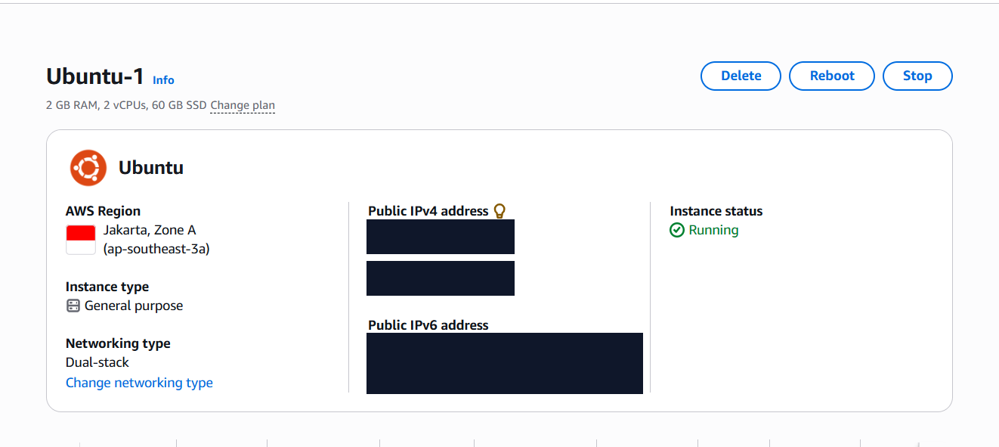

### 2. Firewall Rule Hardening
Custom web ports were removed from the Lightsail firewall once internal Tailscale access was verified.

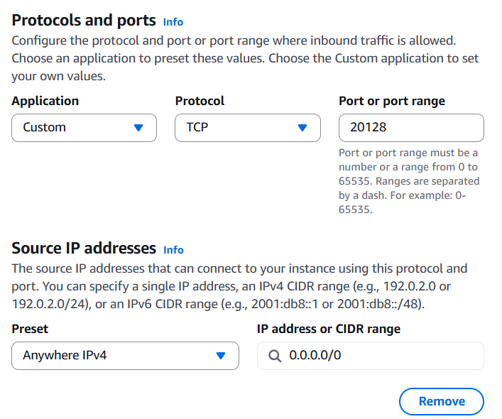

### 3. Docker and Memory Health
Verification of Docker container uptime and the 2 GB swapfile active as an emergency buffer.

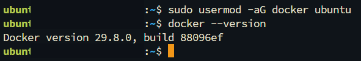
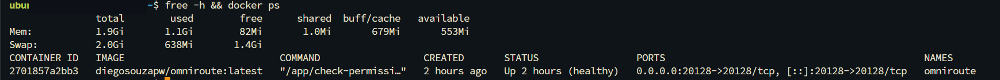

### 4. OmniRoute Proxy Routing
The dashboard shows active model endpoints, provider routing, and token usage telemetry.

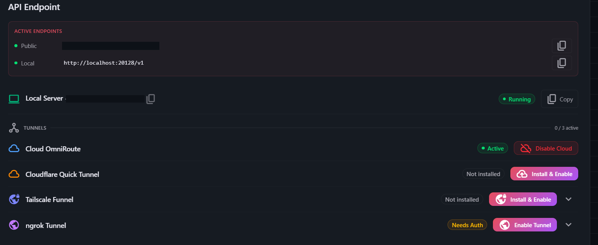
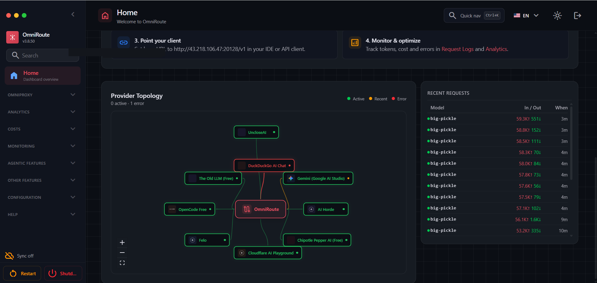
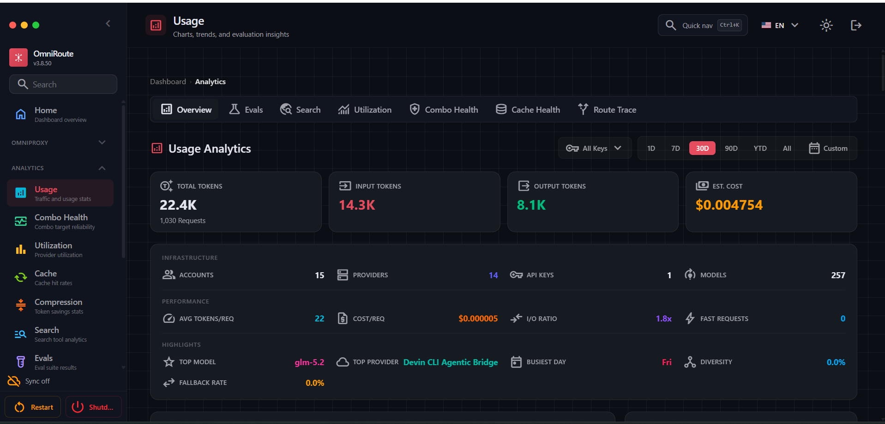

### 5. Hermes Agent State
The Hermes dashboard and systemd service confirming that the agent daemon remains running in the background.

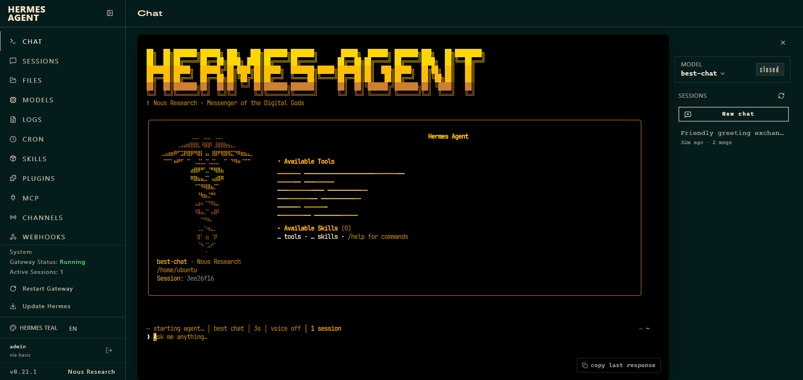
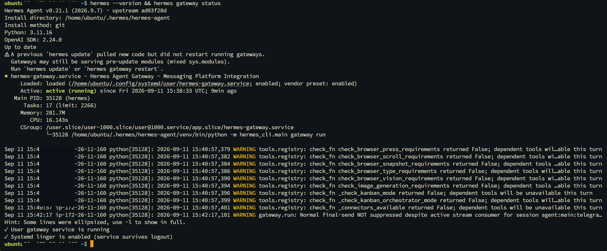

### 6. Live Telegram Execution
A live test running system diagnostics from Telegram. Hermes executes `uptime` and `free -h` directly on the host shell and returns the results to the chat.

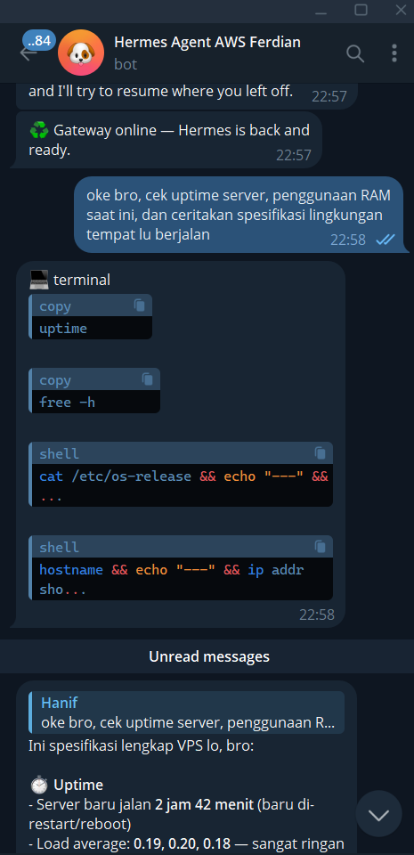

### 7. Tailscale Mesh Verification
Checking point-to-point mesh connectivity between the admin workstation (`100.116.x.x`) and the VPS (`100.90.x.x`). Dashboards load securely over the private WireGuard tunnel.

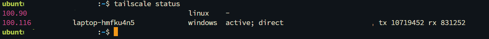
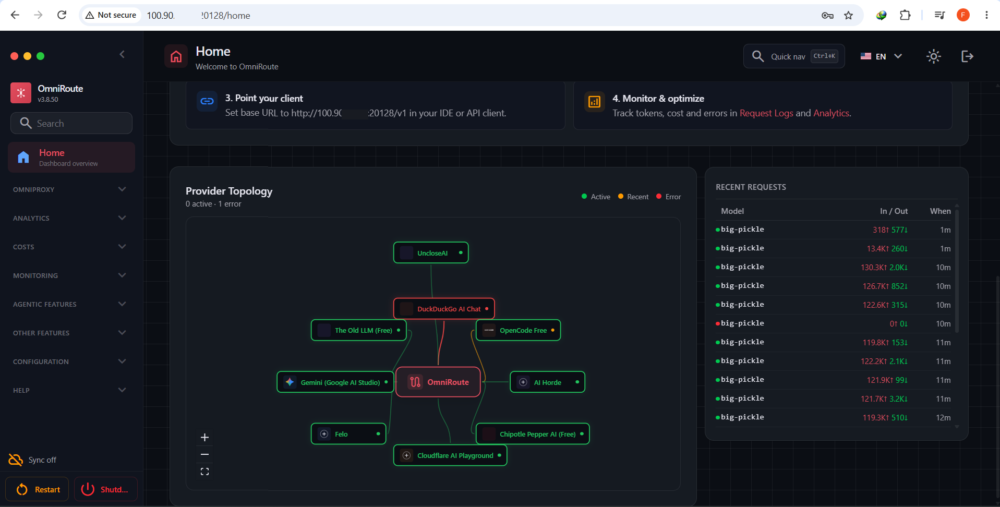
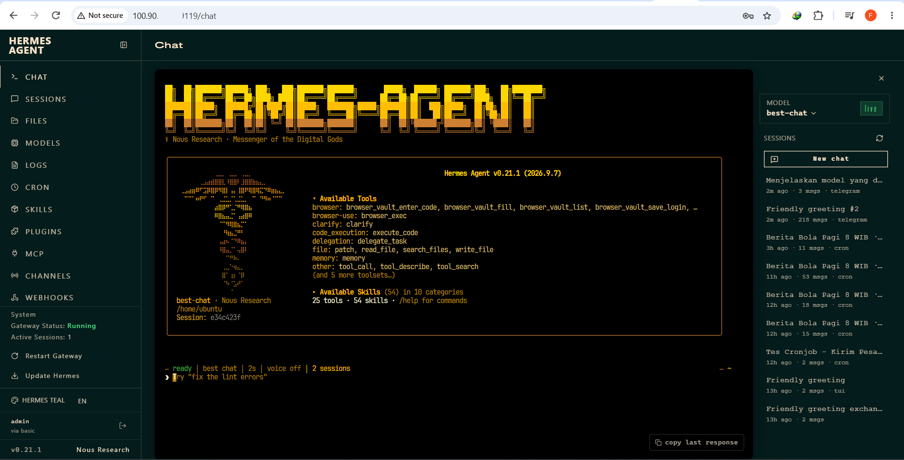

---

## Troubleshooting: Fixing Internal Hairpin Routing

### The Issue
After removing port 20128 from the AWS Lightsail firewall, requests from Telegram started timing out:

```text
APITimeoutError: Request timed out (base_url=http://<PUBLIC_IP>:20128/v1)
```

### Why It Happened
During initial setup, the onboarding wizard saved the instance's public IP as the API URL in `~/.hermes/config.yaml`. When the agent sent requests to its own public IP, the packets went out to the AWS firewall boundary. Because port 20128 was now closed in the firewall, AWS dropped the packets. Lightsail does not support automatic hairpin NAT reflection for closed external ports.

### The Fix
Point the `base_url` directly to localhost:

```bash
sed -i 's|http://<PUBLIC_IP>:20128/v1|http://127.0.0.1:20128/v1|g' ~/.hermes/config.yaml
hermes gateway restart
```

Routing internal calls through `127.0.0.1` fixed the timeouts immediately. It also keeps internal prompt traffic inside host memory instead of routing it through physical network interfaces.

---

## FinOps & Cost Breakdown

### Monthly Expense
- **AWS Lightsail Compute**: $12.00 / month (2 vCPUs, 2 GB RAM, 60 GB SSD, 3 TB bandwidth).
- **LLM Inference**: $0.00 / month by pooling free tiers (Google Gemini 1.5 Flash, Groq, OpenCode Free).
- **Private Mesh Networking**: $0.00 / month (Tailscale free personal plan).
- **Total Operating Cost**: **$12.00 / month**.

### Operational Notes
- **Promotional Credit Horizon**: The current staging deployment runs on a 6-month free tier and cloud credit allocation. For long-term production, plan for the standard $12/month VPS fee.
- **Rate Limit Considerations**: Free-tier models have RPM/TPM limits and no uptime guarantees. OmniRoute's auto-fallback handles temporary outages, but business-critical workloads should keep a paid commercial API key (OpenAI, Anthropic, or AWS Bedrock) as a final fallback.
- **Migration Path**: Because Hermes talks to OmniRoute via standard OpenAI API format (`/v1`), switching to commercial models only requires updating keys in OmniRoute without changing any agent code.
